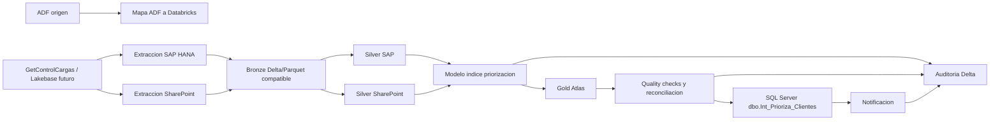

# Arquitectura - Priorizacion de Stock Toledano

## 1. Proposito

Este documento describe la arquitectura objetivo para migrar el modelo ADF **Modelo Priorizacion Stock** hacia Databricks usando **Databricks Asset Bundles**. La solucion mantiene la logica funcional del modelo, reutiliza notebooks existentes cuando aplica y separa responsabilidades en componentes modulares de control, extraccion, transformacion, modelo, calidad, publicacion, auditoria y notificacion.

## 2. Alcance migrado desde ADF

Los pipelines ADF considerados en la migracion son:

| Pipeline ADF | Responsabilidad original | Equivalente Databricks |
|---|---|---|
| `0 orquestador_sap_modelo_priorizacion_stock` | Orquestacion de extraccion SAP y transformacion Bronze to Silver | `job_full_priorizacion_stock` y jobs especificos SAP |
| `0 orquestador_sharepoint_modelo_priorizacion_stock` | Orquestacion de extraccion SharePoint y transformacion Bronze to Silver | `job_full_priorizacion_stock` y jobs especificos SharePoint |
| `0 ext_saphana_priorizacion_stock` | Extraccion SAP HANA hacia Bronze | `job_ext_saphana_priorizacion_stock` |
| `ext_sharepoint_priorizacion_stock` | Extraccion SharePoint hacia Bronze | `job_ext_sharepoint_priorizacion_stock` |
| `0 bronze_to_silver_sap_modelo_priorizacion_stock` | Transformaciones SAP Bronze to Silver | `job_bronze_to_silver_sap_priorizacion_stock` |
| `0 bronze_to_silver_sharepoint_modelo_priorizacion_stock` | Transformaciones SharePoint Bronze to Silver | `job_bronze_to_silver_sharepoint_priorizacion_stock` |
| `0 actulizar_modelo_creacion_indice_priorizacion` | Ejecucion del modelo, publicacion SQL y notificacion | `job_modelo_creacion_indice_priorizacion` y `job_full_priorizacion_stock` |

## 3. Arquitectura logica

## 4. Capas de datos

| Capa | Proposito | Ejemplos |
|---|---|---|
| Bronze | Aterrizaje de fuentes con trazabilidad tecnica | `toledano_bronze_{ambiente}.sap.fact_cv_m_ofertas_doc_ventas`, `toledano_bronze_{ambiente}.sharepoint.grupos_priorizacion` |
| Silver | Datos tipados, limpios y normalizados | `toledano_silver_{ambiente}.sap.fact_cv_lo_pedido`, `toledano_silver_{ambiente}.sharepoint.priorizaciones_previas` |
| Gold | Resultado del modelo y tablas operativas | `toledano_gold_{ambiente}.atlas.resultados_indice_priorizacion` |
| Auditoria/Calidad | Evidencia operacional y reglas de control | `toledano_gold_{ambiente}.atlas.audit_pipeline_events`, `toledano_gold_{ambiente}.atlas.quality_results` |
| SQL Server | Publicacion consumida por sistemas externos | `dbo.Int_Prioriza_Clientes` |

## 5. Componentes principales

| Componente | Ruta | Responsabilidad |
|---|---|---|
| Bundle | `databricks.yml` | Variables, targets `dev`, `test`, `prod` e inclusion de jobs |
| Jobs | `resources/jobs/*.yml` | Orquestacion Databricks reemplazando pipelines ADF |
| Control | `src/priorizacion_stock_toledano/control` | Lectura de `GetControlCargas` y alternativa Lakebase |
| Extraccion | `src/priorizacion_stock_toledano/extraction` | Lectura SAP HANA y SharePoint sin secretos hardcodeados |
| Transformaciones | `src/priorizacion_stock_toledano/transformations` | Bronze to Silver con logica refactorizada |
| Modelo | `src/priorizacion_stock_toledano/model` | Parametros del modelo y calculo del indice |
| Publicacion | `src/priorizacion_stock_toledano/publication` | Escritura JDBC hacia SQL Server |
| Calidad | `src/priorizacion_stock_toledano/quality` | Validaciones minimas y reconciliacion |
| Auditoria | `src/priorizacion_stock_toledano/audit` | Eventos Delta y notificaciones |

## 6. Descripcion por componente del repositorio

### 6.1 `resources/jobs`

Contiene la definicion declarativa de los Databricks Jobs administrados por el bundle. La segunda pasada compacta los jobs en archivos por frente operativo para reducir duplicacion sin perder la separacion logica de tareas. El job principal, `job_full_priorizacion_stock`, reemplaza la orquestacion ADF end to end y ejecuta las tareas en el orden operativo definido.

Jobs incluidos:

- `01_full.yml`
- `02_extracciones.yml`
- `03_transformaciones.yml`
- `04_modelo_publicacion.yml`

### 6.2 `notebooks`

Los notebooks son puntos de entrada operativos para Databricks Jobs. Cada notebook debe mantenerse como orquestador de una etapa y delegar la logica reutilizable al paquete Python en `src`.

Organizacion por etapa:

- `01_control`: lectura de control de cargas desde SQL Server o Lakebase.
- `02_extraccion`: extracciones SAP HANA y SharePoint.
- `03_transformacion`: transformaciones refactorizadas desde notebooks originales.
- `04_modelo`: parametrizacion y ejecucion del modelo de indice.
- `05_publicacion`: publicacion del resultado Gold hacia SQL Server.
- `06_operacion`: calidad, reconciliacion ADF vs Databricks, auditoria y notificaciones.

### 6.3 `src/priorizacion_stock_toledano`

Contiene el codigo Python versionado, reusable y testeable. Esta capa evita que los notebooks acumulen logica compleja y permite validar transformaciones con pruebas unitarias.

Submodulos principales:

| Modulo | Responsabilidad |
|---|---|
| `control` | Normalizacion de `GetControlCargas`, lectura JDBC SQL Server y opcion Lakebase PostgreSQL |
| `extraction` | Construccion de queries SAP HANA, extraccion JDBC, mapeo SharePoint y metricas |
| `transformations` | Limpieza de tildes, nulos, casts y escrituras Silver |
| `model` | Resolucion de tablas por ambiente y calculo del indice de priorizacion |
| `publication` | Publicacion JDBC a SQL Server con modos `append`, `overwrite` y `truncate_insert` |
| `quality` | Reglas de existencia, nulos, duplicados y reconciliacion de conteos |
| `audit` | Registro de eventos Delta y payloads de notificacion |

### 6.4 `sql`

Agrupa scripts SQL de soporte. Actualmente contiene la carpeta `sql/lakebase/`, que modela una futura fuente de control en Lakebase PostgreSQL para reemplazar gradualmente el procedimiento `conf.GetControlCargas`.

Scripts Lakebase:

- `001_create_control_tables.sql`
- `002_insert_priorizacion_stock_sample_data.sql`
- `003_create_control_views.sql`

### 6.5 `tests`

Contiene pruebas unitarias enfocadas en contratos y reglas criticas. Las pruebas usan mocks cuando no es viable ejecutar Spark, SAP HANA, SharePoint o SQL Server localmente.

Coberturas relevantes:

- Construccion de queries y URLs JDBC sin credenciales.
- Normalizacion del contrato de control de cargas.
- Transformaciones Bronze to Silver.
- Parametrizacion del modelo.
- Funciones principales del indice.
- Publicacion SQL y sanitizacion de errores.
- Auditoria, notificacion, calidad y reconciliacion.

### 6.6 `docs`

Contiene la documentacion tecnica lista para revision, operacion y transferencia. Incluye arquitectura, runbook operativo, matriz ADF a Databricks y evolucion Lakebase.

## 7. Seguridad

La arquitectura prohibe credenciales, tokens, passwords y URLs firmadas en codigo o YAML. Todos los valores sensibles se resuelven mediante:

- Databricks Secret Scope.
- Azure Key Vault respaldando Secret Scope.
- Variables seguras del bundle para nombres de secretos, no para valores.

Los parametros sensibles relevantes son:

- `sql_control_*_secret`
- `sql_publication_username_secret`
- `sql_publication_password_secret`
- `sql_publication_server` y `sql_publication_database` se configuran como valores no sensibles del bundle, de acuerdo con los linked services del ARM.
- `sap_hana_*_secret`
- `sharepoint_*_secret`
- `notification_endpoint_secret`

## 8. Ambientes

El bundle soporta:

| Target | Uso | Catalogos esperados |
|---|---|---|
| `dev` | Desarrollo y pruebas tecnicas | `toledano_bronze_dev`, `toledano_silver_dev`, `toledano_gold_dev` |
| `test` | Validacion funcional y paralelos ADF | `toledano_bronze_test`, `toledano_silver_test`, `toledano_gold_test` |
| `prod` | Ejecucion productiva | `toledano_bronze_prod`, `toledano_silver_prod`, `toledano_gold_prod` |

## 9. Principios de diseno

- Mantener compatibilidad con el contrato ADF mientras se migra gradualmente.
- Separar notebooks orquestadores de logica reusable en Python.
- Evitar dependencias directas a IDs de jobs ADF.
- Centralizar parametros en Databricks Asset Bundles.
- Registrar auditoria, calidad y reconciliacion como tablas Delta.
- Preparar evolucion futura hacia Lakebase PostgreSQL sin cambiar el resto del pipeline.
